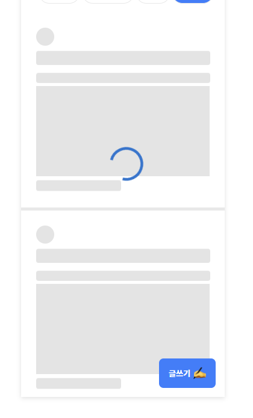
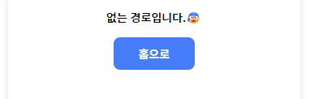
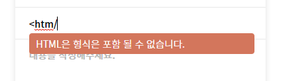
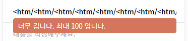
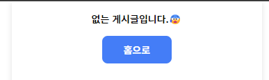
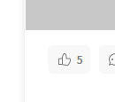
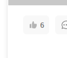

## 1. 프로젝트 소개

실제 API 서버가 없습니다. MOCK SERVER에 들어있는 커뮤니티 글을 보여주는 웹앱입니다.

## 2. 기술 스택

- `TypeScript` : 정적 타입을 도입하여 코드 안전성 및 유지보수를 쉽게 하기위해 사용
- `Redux/tookit` : 리덕스 보일러플레이트를 줄이고, 전역상태 관리하기 위해 사용
- `Redux-persist` : 리덕스 스토어 데이터를 로컬, 세션 스토리지에 저장하기 위해 사용
- `Axios` : Mock Server에서 데이터 받아오기 위해 사용
- `Styled-components` : css-in-js을 통해 컴포넌트 스타일을 관리하기 위해 사용
- `Swiper` : 카테고리 및 게시글 등록 이미지를 캐러샐로 보여주기 위해 사용
- `react-quill` : 커뮤니티 게시글 등록을 위한 에디터

## 3. 프로젝트 구조

```ts
│
├── mock                   // mock data가 들어있는 폴더
├── public                 // favicon 등 static Resource 저장
├── src
│   ├── api                // REST API 사용을 위한 HTTP 서비스, Axios Error Handle
│   ├── assets             // 이미지 및 글로벌 style, theme
│   └── components         // common을 이용하여 만든 컴포넌트 모음 및 비지니스 로직
│       └── common         // 재사용 할 수 있는 UI 컴포넌트 모음
│   ├── hooks              // Custom Hooks
│   ├── modules            // redux/toolkit Slice 모음
│   ├── pages              // 라우터 경로에 따른 나타나는 페이지 컴포넌트 모음
│   ├── types              // 타입스크립트 타입 추론을 도와주는 d.ts 파일 모음
│   ├── utile              // 재사용할 수 있는 utils 모음
│   ├── App.tsx
│   └── index.tsx
├── .env                   // 환경변수
├── README.md
├── package.json           // 의존성 설정 파일
```

> ⚙ 프로젝트 실행 해보기

```ts
npm install
npm run dev // npm run dev를 하면 리액트, mock server가 한번에 실행됩니다.
브라우저 localhost:3000 접속
```

## 4. 페이지 동작 소개

### List 페이지

1. 무한 스크롤로 동작합니다.
2. 카테고리를 이용하여 커뮤니티 글을 필터링할 수 있습니다.
3. 카테고리를 클릭하여 새로운 필터링을 하기전 까지는 새로고침, 페이지를 이동하여도 데이터 및 스크롤 위치는 고정됩니다. `(브라우저는 닫으면 모두 초기화)`
4. 카테고리를 클릭하여 새로운 필터링을 하면 스크롤 위치는 초기화 됩니다.
5. 새로운 데이터를 가져올 때는 사용자한테 스켈레톤, 프로그래스 바를 통해서 데이터를 받아온다는 걸 인식 시켜줍니다.
<div align=center>
   
</div>
6. 없는 URL을 입력 시 홈으로 이동하도록 유도
<div align=center>
   
</div>

### Write 페이지

1. 새로고침, 페이지이동을 하여도 작성했던 글, 이미지는 유지가 됩니다.`(브라우저는 닫으면 모두 초기화)`
2. 제목은 최대 100자, HTML 형식은 입력하지 못합니다. 룰을 위배 시 ErrorMessage 컴포넌트를 이용하여 사용자한테 알려줍니다.
<div align=center>
   
   
</div>
3. 이미지는 최대 6장, 중복된 이름은 업로드되지 않습니다. 이미지는 업로드한 순서를 유지합니다.
4. 최대 6장, jpg, jpeg, png, 최대 이미지 크기 1MB 의 규칙을 위배했을 시 유저한테 팝업으로 알려줍니다.

### Detail 페이지

1. Detail 페이지 접근 시 viewCount가 증가합니다.
2. 좋아요를 누르면 likeCount가 반영이 되고 좋아요를 누른 상태가 유지됩니다.
3. 이미 좋아요를 하고 있다면 좋아요 제거, 신규 좋아요면 추가합니다.
<div align=center>
   
</div>

4. 없는 게시글 URL을 입력 시 홈으로 이동하도록 유도
<div align=center>
   
   
</div>
